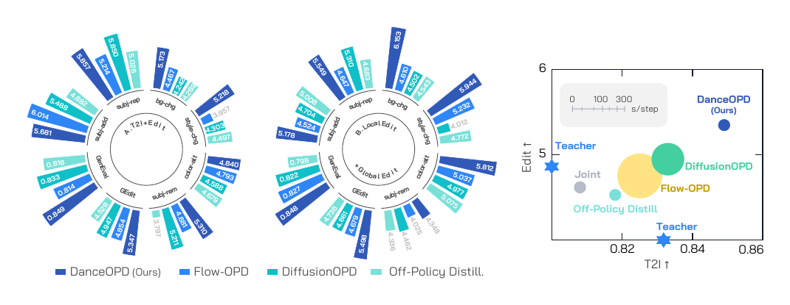
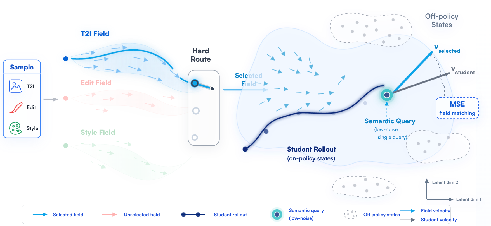
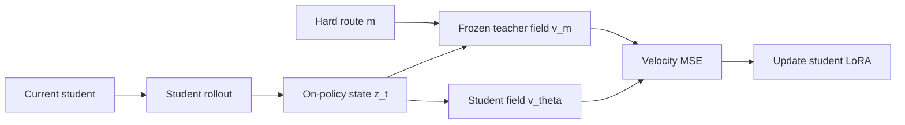
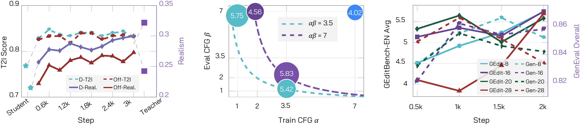
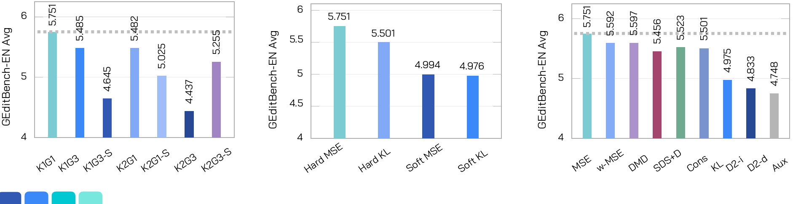
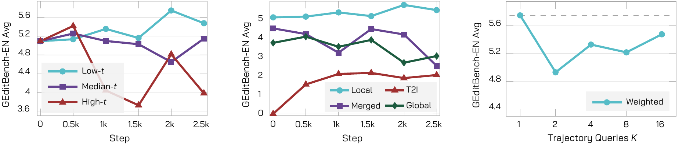
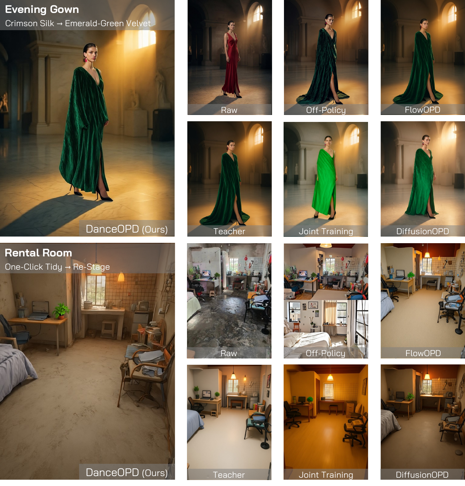
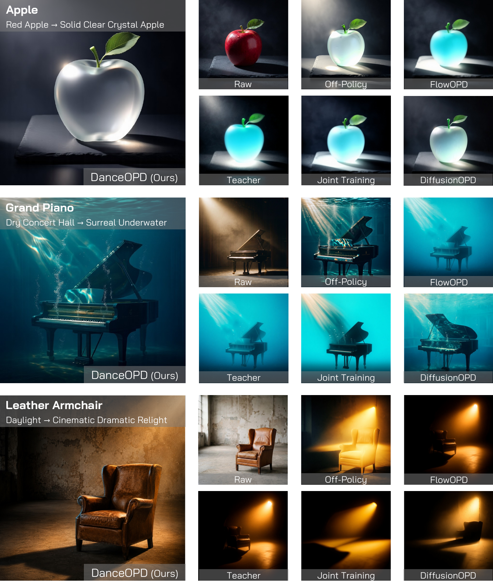
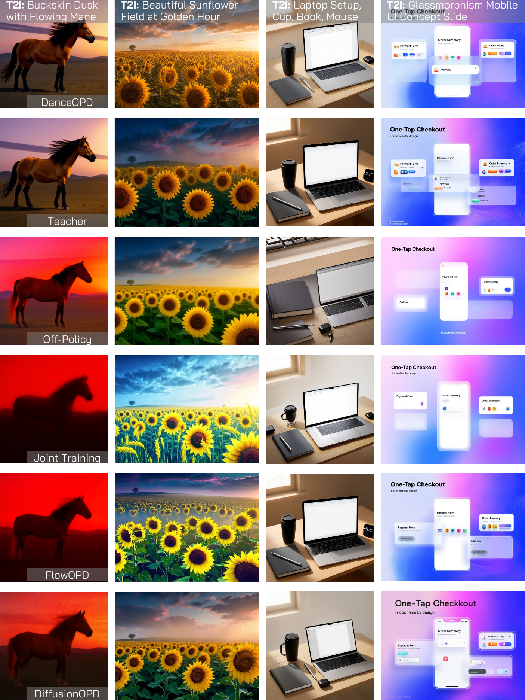
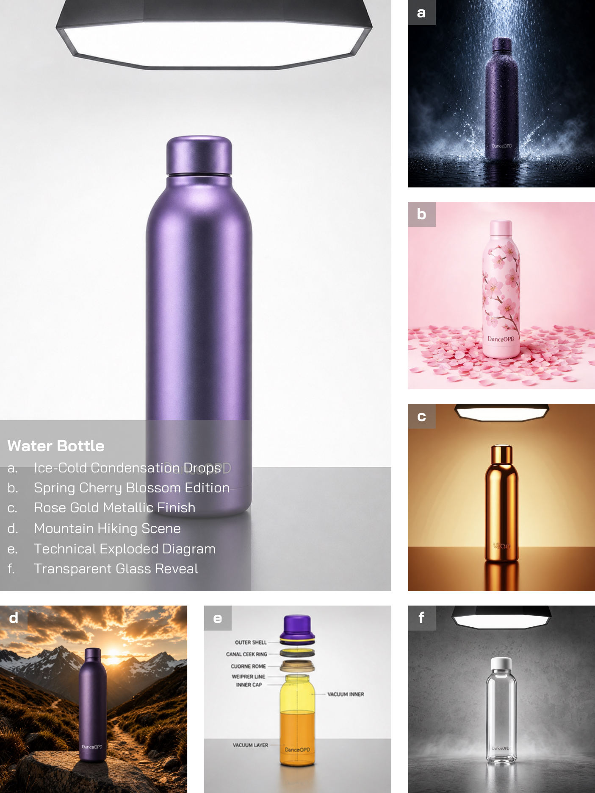

<div align="center">

# ✨ DanceOPD

## On-Policy Generative Field Distillation for Flow-Matching Image Generators

Wei Zhou, Xiongwei Zhu, Zelin Xu, Bo Dong, Lixue Gong, Yongyuan Liang, Meng Chu, Leigang Qu, Lingdong Kong, Wei Liu, Tat-Seng Chua

<p align="center">
  <a href="https://arxiv.org/abs/2606.27377">
    
  </a>
  <a href="https://danceopd.github.io/">
    
  </a>
  
  
</p>

<br>



<br>

**This repository preview contains the paper landing README and visual assets only.**  
**Implementation files are prepared but will be added after release approval.**

</div>

---

## 🔔 Release Status

The code is still under review

---

## 📌 Abstract

Modern image generation systems increasingly need one deployed model to combine multiple capabilities: text-to-image generation, local editing, global transformations, style or realism absorption, and operator behaviors such as classifier-free guidance. A naive mixture of data or weights often creates interference: the student may improve one capability while losing another.

**DanceOPD** treats each source capability as a **velocity field**. At each training step, it samples one capability route, rolls out the current student, queries the selected frozen teacher on a low-noise state from that student trajectory, and updates the student with a direct velocity-matching objective.

<div align="center">

</div>

---

## 🌟 Highlights

- **On-policy field query.** Teachers supervise states visited by the current student, not offline or teacher-only states.
- **Hard-routed capability matching.** Each sample is assigned to one semantically valid teacher field, avoiding ambiguous multi-field averages.
- **Semantic-side query.** The default uses one low-noise query state (`K=1`) per rollout.
- **Plain objective.** Direct velocity MSE is sufficient in our SFT-teacher setting; no reward model or adversarial critic is required.
- **Backend-extensible design.** The approved release is planned to support SD3.5 and Z-Image, with a clean backend interface for other flow models.

---

## 🧠 Method at a Glance

DanceOPD distills a set of teacher fields \(\{v_m\}\) into one student field \(v_\theta\). For route \(m\), condition \(c\), and student rollout state \(z_t^\theta\):

\[
\mathcal{L}_{\text{DanceOPD}}
= \mathbb{E}_{m,c,t}\left[
\left\|v_\theta(\operatorname{sg}(z_t^\theta), t, c)
- v_m(\operatorname{sg}(z_t^\theta), t, c)\right\|_2^2
\right].
\]

<div align="center">

</div>

Conceptual update:

```text
1. Sample one capability route.
2. Roll out the current student.
3. Select a semantic-side state from the student trajectory.
4. Query the corresponding frozen teacher at that same state.
5. Match student velocity to teacher velocity.
```

<div align="center">



</div>

---

## 📊 Main Results

The manuscript evaluates capability synthesis using fine-grained image-editing and text-to-image metrics. Here we summarize the source fields and the final DanceOPD student.

### A. T2I + Edit Fusion

| Model | Role | subj-add | subj-rep | bg-chg | style-chg | color-alt | subj-rem | GEdit Avg ↑ | single | two | count | color | position | color-attr | GenEval ↑ |
|---|---|---:|---:|---:|---:|---:|---:|---:|---:|---:|---:|---:|---:|---:|---:|
| T2I source | base student / T2I anchor | — | — | — | — | — | — | — | 0.950 | 0.939 | 0.938 | 0.947 | 0.520 | 0.700 | 0.832 |
| Edit source | teacher field | 6.033 | 5.417 | 4.490 | 3.923 | 4.889 | 4.828 | 4.930 | 0.838 | 0.828 | 0.713 | 0.840 | 0.580 | 0.470 | 0.711 |
| **DanceOPD student** | **ours** | **5.681** | **5.857** | **5.173** | **5.218** | **4.840** | **5.310** | **5.347** | **0.988** | **0.939** | **0.963** | **0.894** | **0.640** | **0.670** | **0.849** |

DanceOPD raises editing quality above the edit source average while keeping, and slightly improving, the T2I anchor on GenEval.

### B. Local Edit + Global Edit Fusion

| Model | Role | subj-add | subj-rep | bg-chg | style-chg | color-alt | subj-rem | GEdit Avg ↑ | single | two | count | color | position | color-attr | GenEval ↑ |
|---|---|---:|---:|---:|---:|---:|---:|---:|---:|---:|---:|---:|---:|---:|---:|
| Local Edit source | preservation-heavy teacher | 5.555 | 5.742 | 4.856 | 3.817 | 4.581 | 6.017 | 5.095 | 0.988 | 0.929 | 0.813 | 0.862 | 0.600 | 0.570 | 0.793 |
| Global Edit source | transformation-heavy teacher | 3.119 | 4.414 | 4.040 | 5.209 | 4.287 | 1.433 | 3.750 | 0.950 | 0.939 | 0.838 | 0.872 | 0.600 | 0.650 | 0.808 |
| **DanceOPD student** | **ours** | **5.178** | **5.549** | **6.153** | **5.944** | **5.812** | **4.348** | **5.498** | **1.000** | **0.949** | **0.925** | **0.926** | **0.650** | **0.640** | **0.848** |

DanceOPD avoids collapsing toward either source: it absorbs global transformations while retaining strong local-edit and T2I behavior.

<div align="center">

</div>

---

## 🔬 Diagnostics and Ablations

<div align="center">
<table>
<tr>
<td width="50%"></td>
<td width="50%"></td>
</tr>
<tr>
<td><b>Field absorption / rollout diagnostics.</b></td>
<td><b>Routing and query diagnostics.</b></td>
</tr>
<tr>
<td width="50%"></td>
<td width="50%"></td>
</tr>
<tr>
<td><b>Low-noise semantic queries and relevant initialization are reliable.</b></td>
<td><b>The student absorbs realism fields while preserving prompt content.</b></td>
</tr>
</table>
</div>

---

## 🖼️ Qualitative Gallery

<div align="center">
<table>
<tr>
<td></td>
<td></td>
<td></td>
</tr>
<tr>
<td><b>Global edits</b></td>
<td><b>Local + global edits</b></td>
<td><b>Material / lighting / style edits</b></td>
</tr>
<tr>
<td></td>
<td></td>
<td></td>
</tr>
<tr>
<td><b>T2I preservation</b></td>
<td><b>Same-object transformations</b></td>
<td><b>Training progression</b></td>
</tr>
</table>
</div>

---

## 📚 Citation

```bibtex
@misc{zhou2026danceopdonpolicygenerativefield,
      title={DanceOPD: On-Policy Generative Field Distillation},
      author={Wei Zhou and Xiongwei Zhu and Zelin Xu and Bo Dong and Lixue Gong and Yongyuan Liang and Meng Chu and Leigang Qu and Lingdong Kong and Wei Liu and Tat-Seng Chua},
      year={2026},
      eprint={2606.27377},
      archivePrefix={arXiv},
      primaryClass={cs.CV},
      url={https://arxiv.org/abs/2606.27377},
}
```
