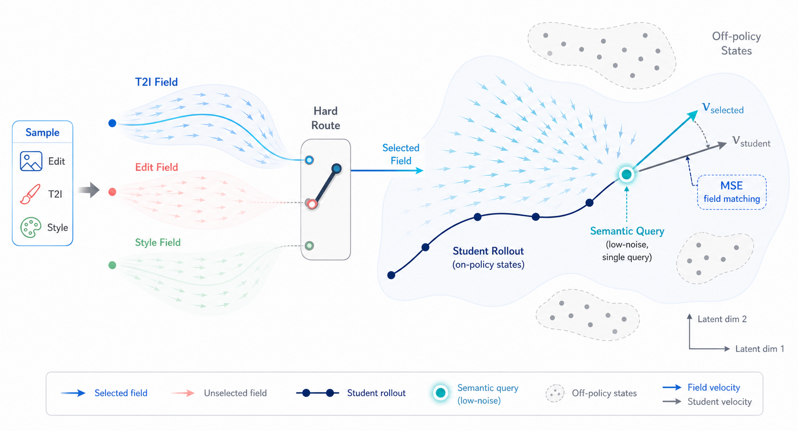
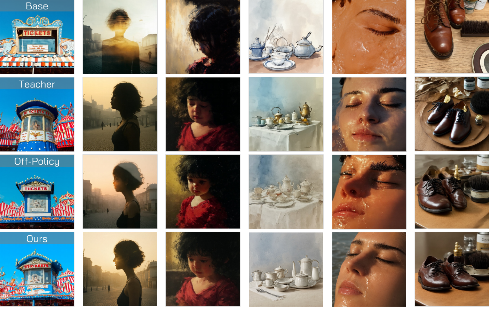
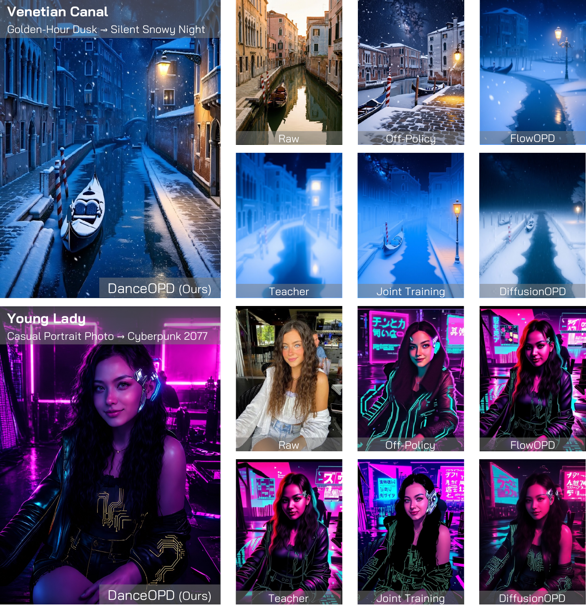
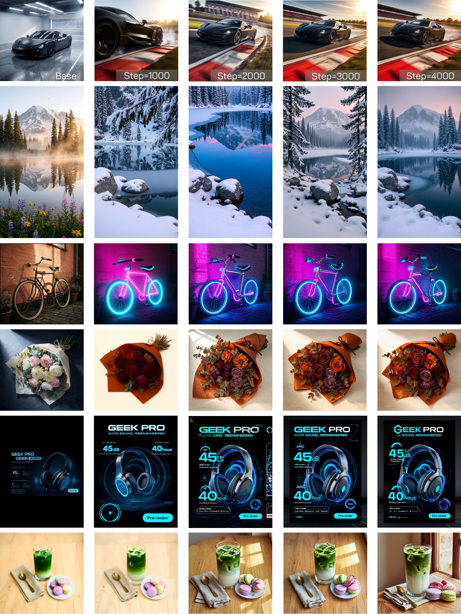

<div align="center">

# ✨ DanceOPD: On-Policy Generative Field Distillation ✨

**Hard-routed on-policy capability-field distillation for flow-matching image generators**

<p align="center">
  Wei Zhou<sup>1,2,‡</sup>, Xiongwei Zhu<sup>1</sup>, Zelin Xu<sup>1</sup>, Bo Dong<sup>1</sup>, Lixue Gong<sup>1</sup>, Yongyuan Liang<sup>3</sup>,<br>
  Meng Chu<sup>4</sup>, Leigang Qu<sup>2</sup>, Lingdong Kong<sup>2</sup>, Wei Liu<sup>1,†</sup>, Tat-Seng Chua<sup>2</sup>
</p>

<p align="center">
  <a href="https://seed.bytedance.com/"> <sup>1</sup> ByteDance Seed</a>
  &nbsp;&nbsp;·&nbsp;&nbsp;
  <a href="https://www.nus.edu.sg/"> <sup>2</sup> NUS</a>
  &nbsp;&nbsp;·&nbsp;&nbsp;
  <a href="https://umd.edu/"> <sup>3</sup> UMD</a>
  &nbsp;&nbsp;·&nbsp;&nbsp;
  <a href="https://hkust.edu.hk/"> <sup>4</sup> HKUST</a>
</p>

<p align="center"><sub><sup>‡</sup> Work done at ByteDance Seed &nbsp;&nbsp;·&nbsp;&nbsp; <sup>†</sup> Corresponding author</sub></p>

<p align="center">
  <a href="https://arxiv.org/abs/2606.27377">
    
  </a>
  <a href="https://danceopd.github.io/">
    
  </a>
  <a href="https://github.com/worldbench/DanceOPD">
    
  </a>
  <a href="LICENSE">
    
  </a>
</p>

<p align="center">
  
  
  
</p>

<br><br>


</div>

---

## 📌 Abstract

Modern image generation systems increasingly need one deployed model to combine multiple capabilities: text-to-image generation, local editing, global transformations, style or realism absorption, and operator behaviors such as classifier-free guidance. A naive mixture of data or weights often creates interference: the student may improve one capability while losing another.

**DanceOPD** treats each source capability as a **velocity field**. For every training step, it samples one route, rolls out the current student, queries the selected frozen teacher on a low-noise state from that student trajectory, and updates the student with a simple velocity-MSE objective. This gives a compact and extensible recipe for post-training flow-matching generators without bundling task-specific training code into the core algorithm.

<div align="center">

</div>

---


## 🌟 Highlights

- **On-policy field query.** Teachers supervise states visited by the current student, not offline or teacher-only states.
- **Hard-routed capability matching.** Each sample is assigned to one semantically valid teacher field, avoiding ambiguous multi-field averages.
- **Semantic-side query.** The default uses one low-noise query state (`K=1`) per rollout.
- **Plain objective.** The public default is direct velocity MSE; no reward model or adversarial critic is required.
- **Backend-extensible.** The same core trainer supports SD3.5 and Z-Image, and can be extended to other flow backbones.

---

## 🧠 Method

DanceOPD uses the following update:

<div align="center">

</div>

For a route \(m\), prompt or condition \(c\), student rollout state \(z_t^\theta\), and frozen teacher field \(v_m\):

\[
\mathcal{L}_{\text{DanceOPD}}
= \mathbb{E}_{m,c,t}\left[
\left\|v_\theta(\operatorname{sg}(z_t^\theta), t, c)
- v_m(\operatorname{sg}(z_t^\theta), t, c)\right\|_2^2
\right].
\]

Minimal pseudocode:

```python
route = router.sample()                         # hard route one teacher
prompt = prompt_dataset.sample(route)
trajectory = rollout(student, prompt)           # current student trajectory
state = sample_low_noise_state(trajectory)      # default: K = 1

with torch.no_grad():
    target = teacher[route].velocity(state, prompt)

pred = student.velocity(state, prompt)
loss = mse(pred, target)
loss.backward()
```

---

## 📊 Main Results

The manuscript evaluates capability synthesis with the same fine-grained metrics used in the paper: six GEditBench-EN editing categories and six GenEval text-to-image categories. Here we show the source/student values together with the final DanceOPD student.

> **GEditBench-EN:** `subj-add`, `subj-rep`, `bg-chg`, `style-chg`, `color-alt`, `subj-rem`, `Avg`<br>
> **GenEval:** `single`, `two`, `count`, `color`, `position`, `color-attr`, `Overall`

### A. T2I + Edit Fusion

| Model | Role | subj-add | subj-rep | bg-chg | style-chg | color-alt | subj-rem | GEdit Avg ↑ | single | two | count | color | position | color-attr | GenEval ↑ |
|---|---|---:|---:|---:|---:|---:|---:|---:|---:|---:|---:|---:|---:|---:|---:|
| T2I source | base student / T2I anchor | — | — | — | — | — | — | — | 0.950 | 0.939 | 0.938 | 0.947 | 0.520 | 0.700 | 0.832 |
| Edit source | teacher field | 6.033 | 5.417 | 4.490 | 3.923 | 4.889 | 4.828 | 4.930 | 0.838 | 0.828 | 0.713 | 0.840 | 0.580 | 0.470 | 0.711 |
| **DanceOPD student** | **ours** | **5.681** | **5.857** | **5.173** | **5.218** | **4.840** | **5.310** | **5.347** | **0.988** | **0.939** | **0.963** | **0.894** | **0.640** | **0.670** | **0.849** |

DanceOPD raises editing quality above the edit source average while keeping, and slightly improving, the T2I anchor on GenEval.

### B. Local Edit + Global Edit Fusion

| Model | Role | subj-add | subj-rep | bg-chg | style-chg | color-alt | subj-rem | GEdit Avg ↑ | single | two | count | color | position | color-attr | GenEval ↑ |
|---|---|---:|---:|---:|---:|---:|---:|---:|---:|---:|---:|---:|---:|---:|---:|
| Local Edit source | preservation-heavy teacher | 5.555 | 5.742 | 4.856 | 3.817 | 4.581 | 6.017 | 5.095 | 0.988 | 0.929 | 0.813 | 0.862 | 0.600 | 0.570 | 0.793 |
| Global Edit source | transformation-heavy teacher | 3.119 | 4.414 | 4.040 | 5.209 | 4.287 | 1.433 | 3.750 | 0.950 | 0.939 | 0.838 | 0.872 | 0.600 | 0.650 | 0.808 |
| **DanceOPD student** | **ours** | **5.178** | **5.549** | **6.153** | **5.944** | **5.812** | **4.348** | **5.498** | **1.000** | **0.949** | **0.925** | **0.926** | **0.650** | **0.640** | **0.848** |

DanceOPD avoids collapsing toward either source: it absorbs global transformations while retaining strong local-edit and T2I behavior.

<div align="center">

</div>

---

## 🔬 Diagnostics

<div align="center">
<table>
<tr>
<td width="33%"></td>
<td width="33%"></td>
<td width="33%"></td>
</tr>
<tr>
<td><b>Field absorption.</b> DanceOPD absorbs realism and CFG-like fields while keeping rollout discretization stable.</td>
<td><b>Ablation trends.</b> Low-noise semantic queries and strong relevant initialization are reliable.</td>
<td><b>Realism-field absorption.</b> The student moves toward the realism teacher while preserving prompt content.</td>
</tr>
</table>
</div>

---

## 🖼️ Qualitative Gallery

<div align="center">
<table>
<tr>
<td></td>
<td></td>
<td></td>
</tr>
<tr>
<td><b>Global edits</b></td>
<td><b>Local + global edits</b></td>
<td><b>Material / lighting / style edits</b></td>
</tr>
<tr>
<td></td>
<td></td>
<td></td>
</tr>
<tr>
<td><b>T2I preservation</b></td>
<td><b>Same-object transformations</b></td>
<td><b>Training progression</b></td>
</tr>
</table>
</div>

---

## ⚙️ Installation

```bash
git clone https://github.com/worldbench/DanceOPD.git
cd DanceOPD

# SD3.5 backend + smoke data helper
pip install -e ".[sd35,smoke]"

# Z-Image backend + smoke data helper
pip install -e ".[zimage,smoke]"

# OmniEdit / Hugging Face dataset preprocessing
pip install -e ".[data]"

# Everything except the external DiffSynth-Studio checkout/install
pip install -e ".[all,smoke,data]"
```

The Z-Image backend additionally imports `diffsynth.pipelines.z_image`. Install DiffSynth-Studio following its upstream Z-Image instructions before running full Z-Image training. The config dry-run does not need DiffSynth-Studio.

Configure Accelerate if you use distributed training:

```bash
accelerate config
```

---

## 🚀 Quick Start

Start with the toy smoke test. It downloads the official DiffSynth example metadata, builds a tiny prompt CSV, and runs the complete DanceOPD train/update/save loop **without downloading model weights**.

```bash
pip install -e ".[smoke]"
bash scripts/bootstrap_smoke.sh
```

This is the recommended first command for a fresh checkout. It should finish in seconds and write outputs under `outputs/smoke_toy`.

### 1. Choose your first run

| Goal | Command | What it checks |
|---|---|---|
| Fastest end-to-end smoke, no weights | `bash scripts/bootstrap_smoke.sh` | data prep, router, rollout, teacher query, loss, optimizer, checkpoint save |
| Same toy smoke, direct script | `bash scripts/smoke_toy.sh` | same as above |
| SD3.5 config + data dry run | `BACKEND=sd35 bash scripts/bootstrap_smoke.sh` | dependencies, config, DiffSynth prompt extraction; no large model load |
| Z-Image config + data dry run | `BACKEND=zimage bash scripts/bootstrap_smoke.sh` | dependencies, config, DiffSynth prompt extraction; no large model load |
| Tiny SD3.5 backend training | `RUN_TRAIN=1 BACKEND=sd35 bash scripts/bootstrap_smoke.sh` | real backend load and LoRA update; first run downloads upstream weights |
| Tiny Z-Image backend training | `RUN_TRAIN=1 BACKEND=zimage bash scripts/bootstrap_smoke.sh` | real backend load and LoRA update; requires DiffSynth-Studio Z-Image install |

You can also call backend scripts directly:

```bash
bash scripts/smoke_sd35.sh --dry-run
bash scripts/smoke_zimage.sh --dry-run

# Heavier: launches the actual public model backend.
bash scripts/smoke_sd35.sh
bash scripts/smoke_zimage.sh
```

The smoke path uses the official `DiffSynth-Studio/diffsynth_example_dataset` instead of bundling custom sample data. By default it selects `z_image/Z-Image`, extracts prompts from `metadata.csv`, writes `data/diffsynth_example_dataset/danceopd_prompts.csv`, uses LoRA rank 8, runs a 4-step rollout for 2 optimizer steps, and saves under `outputs/smoke_*`.

If a dependency is missing, the smoke scripts fail early with an install hint. To reuse an already downloaded dataset without ModelScope, set `DIFFSYNTH_NO_DOWNLOAD=1`.

Prepare only the DiffSynth prompt CSV without training:

```bash
bash scripts/prepare_diffsynth_example.sh
```

### 2. Move from smoke test to your own teachers

For real DanceOPD training, prepare a prompt CSV and fill the path-free config template. The public repo does not include our internal teacher LoRAs or student checkpoints.

```csv
prompt
A cinematic portrait of a dancer in a softly lit studio.
A realistic product photo of a glass teapot on a wooden table.
```

An example is provided at `examples/prompts.csv`.

Fill one of the default configs:

- `configs/sd35_danceopd.yaml`
- `configs/zimage_danceopd.yaml`

Teacher fields use one shared interface:

| Teacher case | `base_ckpt` | `lora_dir` | Meaning |
|---|---|---|---|
| Base route | `null` | `null` | use the pretrained base model as a frozen teacher |
| Full checkpoint teacher | `/path/to/full_or_merged_ckpt` | `null` | load a non-LoRA teacher checkpoint |
| LoRA teacher | `null` | `/path/to/peft_lora` | merge one PEFT LoRA into the base teacher |
| Full checkpoint + LoRA | `/path/to/full_or_merged_ckpt` | `/path/to/peft_lora` | load the full checkpoint first, then merge the LoRA |

The student LoRA is created separately from frozen teachers; teacher LoRAs are
merged into clean teacher modules, not stacked on top of the student's training
adapter.

Key default recipe:

```yaml
training:
  method: danceopd
  resolution: 1024
  rollout_steps: 16
  k: 1
  query_bias: low_t
  lr: 2.0e-4
  grad_accum: 4
  max_train_steps: 3000
  save_steps: 300
  mixed_precision: bf16

student:
  lora_rank: 128
  lora_alpha: 128
```

### 3. Launch full training

SD3.5:

```bash
accelerate launch -m danceopd.cli.train \
  --config configs/sd35_danceopd.yaml
```

Z-Image:

```bash
accelerate launch -m danceopd.cli.train \
  --config configs/zimage_danceopd.yaml
```

You can override paths directly from the command line:

```bash
accelerate launch -m danceopd.cli.train \
  --config configs/sd35_danceopd.yaml \
  --set model.pretrained_model='<SD35_MODEL_DIR>' \
  --set teachers.0.base_ckpt='<TEACHER_TRANSFORMER_CKPT>' \
  --set teachers.0.lora_dir='<TEACHER_LORA_DIR>' \
  --set data.prompts_csv='<PROMPTS_CSV>' \
  --set training.output_dir='<OUTPUT_DIR>'
```

---

## 🧩 Supported Backends

| Backend | Package path | Teacher format | Student update |
|---|---|---|---|
| Toy smoke | `danceopd.backends.toy` | deterministic prompt-derived teacher | tiny torch module |
| SD3.5 / Diffusers | `danceopd.backends.sd35_diffusers` | full transformer checkpoint and/or PEFT LoRA | PEFT LoRA |
| Z-Image / DiffSynth | `danceopd.backends.zimage_diffsynth` | DiT checkpoint and/or PEFT LoRA | PEFT LoRA |

To add a new model family, implement `DanceOPDBackend` and register it in `danceopd/core/engine.py`.

---

## 📁 Repository Structure

```text
danceopd/
  core/        # algorithm: routing, rollout-state sampling, loss, trainer
  backends/    # toy smoke, SD3.5, and Z-Image adapters
  data/        # prompt CSV loader
  cli/         # training entrypoint
configs/       # path-free default configs
scripts/       # launch helpers
examples/      # DiffSynth and OmniEdit data preparation helpers
GUIDE.md       # consolidated method, config, and reproducibility guide
assets/        # README figures
```

---

## ✅ Dry Run

Validate config structure without loading models:

```bash
python -m danceopd.cli.train --config configs/sd35_danceopd.yaml --dry-run
python -m danceopd.cli.train --config configs/zimage_danceopd.yaml --dry-run
```

---

## 🔁 Reproducibility Scope

This repository releases the DanceOPD training code, public smoke tests, data adapters, and paper-style config templates. It does **not** release our internal teacher LoRAs or student checkpoints. To reproduce the full pipeline with public assets, prepare OmniEdit-style edit data, train compatible SFT teacher LoRAs or full teacher checkpoints, then run DanceOPD with those teachers.

Useful docs:

- [`GUIDE.md`](GUIDE.md): method, configs, smoke tests, OmniEdit preprocessing, SFT teacher interface, and reproducibility notes.
- [`configs/paper/`](configs/paper/): path-free paper config templates.

---

## 📚 Citation

```bibtex
@article{zhou2026danceopd,
  title={DanceOPD: On-Policy Generative Field Distillation},
  author={Zhou, Wei and Zhu, Xiongwei and Xu, Zelin and Dong, Bo and Gong, Lixue and Liang, Yongyuan and Chu, Meng and Qu, Leigang and Kong, Lingdong and Liu, Wei and others},
  journal={arXiv preprint arXiv:2606.27377},
  year={2026}
}
```

---

## 🙏 Acknowledgements

This repository builds on PyTorch, Accelerate, Diffusers, PEFT, DiffSynth-Studio, Stable Diffusion 3.5, and Z-Image.
